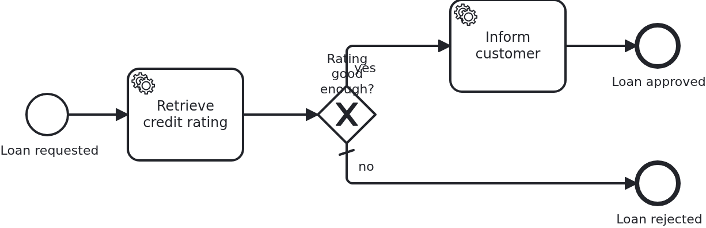

# Learning that a workflow ended

[](./LICENSE)

An application usually wants to know when a business case is closed. The usual way to find
out is a service task in front of the end event, and then a second one in front of the next
end event, and so on. This blueprint shows the other way: one method, called whichever end
the workflow reaches.

## What this blueprint shows



The loan approval ends in two places. One end has a task in front of it, because telling the
customer is work somebody has to do. The other has nothing in front of it - and the
application learns about that end just as well:

```java
@WorkflowEnded
public void loanApprovalEnded(final Aggregate loanApproval, final WorkflowEnd end) {
  service.loanApprovalClosed(loanApproval, end);
}
```

The method sits in the same class as the `@WorkflowTask` methods, because it is the same
direction: the BPMS calling in. VanillaBP loads the aggregate, calls the method and saves the
aggregate, exactly as it does for a task. It may take the aggregate, the `WorkflowEnd`, or
both in either order.

**When to use which.** A task in front of an end event is for WORK: sending a letter,
charging a card, calling a neighbouring system. It belongs in the model because it belongs to
the process, and it has to be visible there. `@WorkflowEnded` is for the FACT that the case is
closed: writing a closing time, releasing a reservation, letting a list of open cases shrink.
Modelling a task for that means adding a box to the diagram for something the engine already
knows, and repeating it in front of every end event you add later.

**What the record tells you.** `WorkflowEnd` carries how the workflow ended, when, and which
end event it reached:

|         Value          |                                                        What it means                                                        |
|------------------------|-----------------------------------------------------------------------------------------------------------------------------|
| `kind() == COMPLETED`  | the workflow reached an end event                                                                                           |
| `kind() == TERMINATED` | it ended without reaching one: cancelled by an operator, a terminate end event, an interrupting event of an enclosing scope |
| `time()`               | when it ended, as the BPMS reports it, or when VanillaBP was told where it does not                                         |
| `endEventId()`         | the BPMN id of the end event, or `null` where the BPMS does not report it                                                   |

**Not every BPMS reports the same.** Camunda 7 names the end event; Camunda 8 does not, so
`endEventId()` is `null` there and this blueprint's test does not assert it. Camunda 8 also
cannot report a cancelled workflow at all - its listeners run for completed instances only,
which its adapter documents as a deviation. Write code which survives both: a `null` end event
is normal, and a business decision must not hang on the distinction a BPMS may not make.

**The notification is at-least-once.** After a crash it may arrive twice, so what the method
does has to tolerate that. Writing a closing time and a status does. Sending a letter does
not, and that is what a task in front of the end event is for.

## Delta to the base blueprint

Compared to [`module-single`](https://github.com/vanillabp-blueprints/module-single-springboot):

|            File            |                                  What is different                                   |
|----------------------------|--------------------------------------------------------------------------------------|
| `loan_approval.bpmn`       | two end events, one with a task in front of it and one without                       |
| `WorkflowTaskHandler.java` | the `@WorkflowEnded` method next to the `@WorkflowTask` methods                      |
| `Service.java`             | closes the business case, and does the work of the task in front of the other end    |
| `Aggregate.java`           | when the case was closed, how, and at which end event                                |
| `loan-approval.yaml`       | the threshold the gateway routes on                                                  |
| `LoanApprovalIT.java`      | one test per end, and the interesting one is the end nothing is modelled in front of |

The gateway is not the subject here. It exists so the process has two ends;
[`bpmn-gateways`](https://github.com/vanillabp-blueprints/bpmn-gateways-springboot) is where
decisions are explained.

## Running it

Requires a JDK 21. Camunda 7 is embedded, so nothing else has to run:

```bash
mvn install verify
```

Running it on another BPMS is a Maven profile, not one line of Java changes:

```bash
mvn install verify -Pcamunda8
```

Camunda 8 is a remote engine, so a cluster has to run. Start one; its address, and everything
else specific to that engine, lives in its profile file
`application/src/main/resources/application-camunda8.yaml`, with a copy for the module's own
test:

```yaml
vanillabp:
  adapters:
    camunda8:
      # Camunda 8 is a remote engine: point this at your cluster.
      rest-address: http://localhost:8080
```

That file is loaded because the Maven profile `camunda8` sets the Spring profile of the same
name, so the engine is chosen once, on the Maven command line, and the build, the tests and
`spring-boot:run` all follow it.

Start the application:

```bash
mvn -pl application spring-boot:run
```

Nothing about identifiers shows up at startup: the BPMS profiles of this blueprint set
`name-clash-avoidance: use-prefix`, so VanillaBP puts the workflow module ID in front of every
identifier before it reaches the engine and takes it off again on the way back. The BPMN files,
the business code and the rest of the configuration keep the plain names, and no tenant is
involved, which matters on a BPMS licensed per tenant. What the modes are and what each of them
costs is in
[the wiki](https://github.com/vanillabp/adapter-platform-integration/wiki/Workflow-modules#how-name-clashes-are-avoided).

The amount decides which end the workflow reaches, so this is the URL to play with:

```
http://localhost:8080/api/loan-approval/start?amount=5000
```

An amount of 5000 is a rating of 50, above the configured minimum of 30, so the customer is
informed and the workflow ends there:

```
Credit rating of loan approval '1e2f…' is 50, which counts as 'acceptable'
The customer of loan approval '1e2f…' was informed
Loan approval '1e2f…' is closed (COMPLETED at 2026-08-15T13:52:01.774Z, end event 'EndEvent_LoanApproved')
```

An amount of 300 takes the other branch, where nothing is modelled at all - and the
application is told anyway:

```
Credit rating of loan approval 'e0f5…' is 3, which counts as 'too-low'
Loan approval 'e0f5…' is closed (COMPLETED at 2026-08-15T13:52:02.154Z, end event 'EndEvent_LoanRejected')
```

On Camunda 8 the same two runs report `end event 'null'`, because that engine does not name
the end event. Everything else is identical, and no Java differs.

The result of a run is at

```
http://localhost:8080/api/loan-approval/{loanRequestId}
```

While the application runs on Camunda 7, Camunda's own web applications are served at

```
http://localhost:8080/camunda
```

Log in with `demo` / `demo`. Cockpit is where an ended instance disappears from the running
ones, which is the view this blueprint replaces for your application: your users should not
have to look into a BPMS to see whether a case is closed.

The Camunda 8 profile brings neither the dependency nor those settings into effect. Its
tooling is part of the cluster, and the file naming a Camunda 7 adapter id is simply not
loaded there - a profile file applies to its own engine and to no other. Naming an adapter
id whose adapter is not on the classpath is a configuration error VanillaBP refuses to
start with, and the profiles are what keeps that from happening.

## How it works

|                                            File                                            |                             Role                             |
|--------------------------------------------------------------------------------------------|--------------------------------------------------------------|
| `loan-approval/src/main/resources/loan-approval/processes/<adapter-id>/loan_approval.bpmn` | two end events, one with work in front of it and one without |
| `.../loanapproval/WorkflowTaskHandler.java`                                                | the `@WorkflowEnded` method, next to the tasks               |
| `.../loanapproval/Service.java`                                                            | closes the business case, in business terms                  |
| `.../loanapproval/model/Aggregate.java`                                                    | when, how and where the workflow ended                       |
| `loan-approval/src/test/.../LoanApprovalIT.java`                                           | one test per end, including the end nothing precedes         |

The order of events: the workflow reaches an end event, the BPMS reports the end, VanillaBP
loads the aggregate and calls the method, and the aggregate is saved. On an embedded engine
that happens in the transaction which ends the workflow; on a remote one the notification
arrives afterwards, which is why it is at-least-once and why nothing in the model waits for
it.

The annotation is optional, and a model without it pays nothing: an adapter attaches its
listener only where a method exists.

## Documentation

- [Workflow tasks](https://github.com/vanillabp/adapter-platform-integration/wiki/Workflow-tasks): what a BPMS reports about the end of a workflow, and what each one can tell apart
- [Workflow aggregates](https://github.com/vanillabp/adapter-platform-integration/wiki/Workflow-aggregates): why the closing time belongs onto the aggregate
- [Wire up a task](https://github.com/vanillabp/spi-for-java#wire-up-a-task): the contract this method shares with a `@WorkflowTask`
- the wiki of the [BPMS adapter](https://github.com/vanillabp/adapter-platform-integration/wiki/BPMS-adapters) you use: whether it names the end event and whether it reports a cancelled workflow

This blueprint is developed in the monorepo
[`blueprints`](https://github.com/vanillabp-blueprints/blueprints). This repository is a
read-only mirror, **issues and pull requests belong there.**

## Noteworthy & Contributors

[VanillaBP](https://www.github.com/vanillabp/spi-for-java) was developed by [Phactum](https://www.phactum.at) with the
intention of giving back to the community as it has benefited the community in the past.


## License

Copyright 2026 Phactum Softwareentwicklung GmbH

Licensed under the Apache License, Version 2.0
